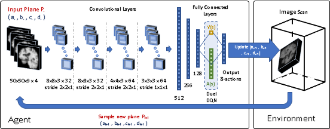
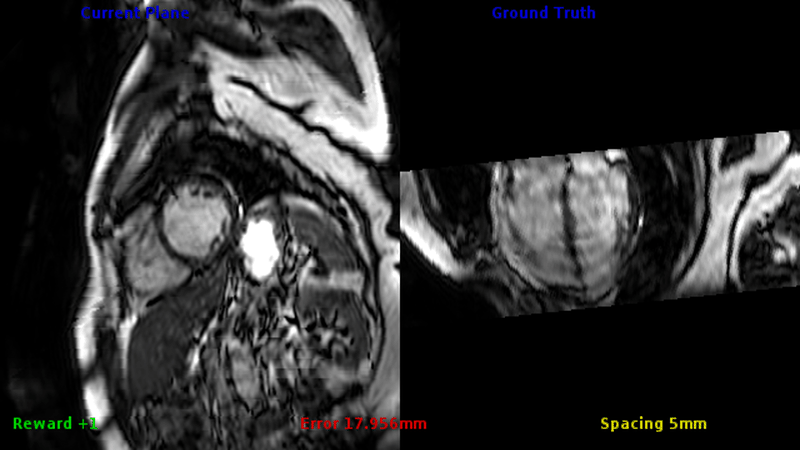

# Automatic View Planning

Standard view images are important in clinical practice as they provide a means
to perform biometric measurements from similar anatomical regions.
In this project, we employ a multi-scale reinforcement learning (RL) agent
framework that enables a natural learning paradigm by interacting with the
environment and mimicking experienced operators' navigation steps.

<p align="center">

</p>

---
## Results

Here are few examples of the learned agent for plane detection on unseen data:

* Detecting the 4-chamber plane in short-axis cardiac MRI acquisition [(HQ video)](videos/cardiac_4ch.mp4)

<p align="center">

</p>

* Detecting the axial plane containing the anterior and posterior commissure (ACPC) line in adult brain MRI acquisition [(HQ video)](videos/brain_acpc.mp4)

<p align="center">

</p>


---
## Usage

### Train
```
python DQN.py --algo DQN --gpu 0
```

### Test
```
python DQN.py --algo DQN --gpu 0 --task play --load path_to_trained_model
```

---
## Citation

If you use this code in your research, please cite this paper:

```
@inproceedings{alansary2018automatic,
  title={Automatic view planning with multi-scale deep reinforcement learning agents},
  author={Alansary, Amir and Le Folgoc, Loic and Vaillant, Ghislain and Oktay, Ozan and Li, Yuanwei and Bai, Wenjia and Passerat-Palmbach, Jonathan and Guerrero, Ricardo and Kamnitsas, Konstantinos and Hou, Benjamin and others},
  booktitle={International Conference on Medical Image Computing and Computer-Assisted Intervention},
  pages={277--285},
  year={2018},
  organization={Springer}
}
```
