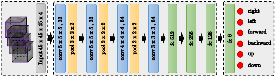
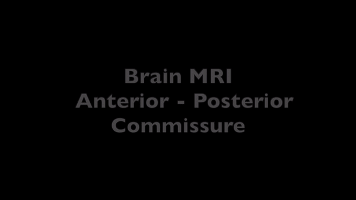

# Multiple Anatomical Landmark Detection using Multi-agent RL

Automatic detection of anatomical landmarks is an important step for a wide range of applications in medical image analysis. The location of anatomical landmarks is interdependent and non-random in a human anatomy, hence locating one is able to help locate others. In this project, we formulate the landmark detection problem as a cocurrent partially observable markov decision process (POMDP) navigating in a medical image environment towards the target landmarks. We create a collaborative Deep Q-Network (DQN) based architecture where we share the convolutional layers amongst agents, sharing thus implicitly knowledge. This code also supports both fixed- and multi-scale search strategies with hierarchical action steps in a coarse-to-fine manner.

<p align="center">


</p>

---
## Results
Here are few examples of the learned agent for landmark detection on unseen data:

* Detecting the apex point and center of mitral valve in short-axis cardiac MRI 


* Detecting the anterior commissure (AC) and posterior commissure point in adult brain MRI 

* Detecting the left and right cerrebellum point in fetal head ultrasound 

<p align="center">

</p>


---

## Usage
```
usage: DQN.py [-h] [--gpu GPU] [--load LOAD] [--task {play,eval,train}]
              [--algo {DQN,Double,Dueling,DuelingDouble}]
              [--files FILES [FILES ...]] [--saveGif] [--saveVideo]
              [--logDir LOGDIR] [--name NAME]

optional arguments:
  -h, --help            show this help message and exit
  --gpu GPU             comma separated list of GPU(s) to use.
  --load LOAD           load model
  --task {play,eval,train}
                        task to perform. Must load a pretrained model if task
                        is "play" or "eval"
  --algo {DQN,Double,Dueling,DuelingDouble}
                        algorithm
  --files FILES [FILES ...]
                        Filepath to the text file that comtains list of
                        images. Each line of this file is a full path to an
                        image scan. For (task == train or eval) there should
                        be two input files ['images', 'landmarks']
  --saveGif             save gif image of the game
  --saveVideo           save video of the game
  --logDir LOGDIR       store logs in this directory during training
  --name NAME           name of current experiment for logs
  --agents AGENTS       number of agents to be trained simulteniously 
```

### Train
```
 python DQN.py --task train --algo DQN --gpu 0 --files './data/filenames/image_files.txt' './data/filenames/landmark_files.txt'
```

### Evaluate
```
python DQN.py --task eval --algo DQN --gpu 0 --load data/models/DQN_multiscale_brain_mri_point_pc_ROI_45_45_45/model-600000 --files './data/filenames/image_files.txt' './data/filenames/landmark_files.txt'
```

### Test
```
python DQN.py --task play --algo DQN --gpu 0 --load data/models/DQN_multiscale_brain_mri_point_pc_ROI_45_45_45/model-600000 --files './data/filenames/image_files.txt'
```

### Citation 
To cite this work use the below bibtex item.


