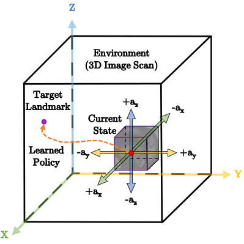

# Anatomical Landmark Detection

Automatic detection of anatomical landmarks is an important step for a wide range of applications in medical image analysis. In this project, we formulate the landmark detection problem as a sequential decision process navigating in a medical image environment towards the target landmark. We deploy multiple Deep Q-Network (DQN) based architectures to train agents that can learn to identify the optimal path to the point of interest. This code also supports both fixed- and multi-scale search strategies with hierarchical action steps in a coarse-to-fine manner.

<p align="center">


</p>

---
## Results
Here are few examples of the learned agent for landmark detection on unseen data:

* Detecting the apex point in short-axis cardiac MRI [(HQ video)](videos/cardiac_apex.mp4)
<p align="center">

</p>

* Detecting the anterior commissure (AC) point in adult brain MRI [(HQ video)](videos/brain_ac.mp4)
<p align="center">

</p>

* Detecting the cavum septum pellucidum (CSP) point in fetal head ultrasound [(HQ video)](videos/fetal_csp.mp4)
<p align="center">

</p>


---

## Usage
```
usage: DQN.py [-h] [--gpu GPU] [--load LOAD] [--task {play,eval,train}]
              [--algo {DQN,Double,Dueling,DuelingDouble}]
              [--files FILES [FILES ...]] [--saveGif] [--saveVideo]
              [--logDir LOGDIR] [--name NAME]

optional arguments:
  -h, --help            show this help message and exit
  --gpu GPU             comma separated list of GPU(s) to use.
  --load LOAD           load model
  --task {play,eval,train}
                        task to perform. Must load a pretrained model if task
                        is "play" or "eval"
  --algo {DQN,Double,Dueling,DuelingDouble}
                        algorithm
  --files FILES [FILES ...]
                        Filepath to the text file that comtains list of
                        images. Each line of this file is a full path to an
                        image scan. For (task == train or eval) there should
                        be two input files ['images', 'landmarks']
  --saveGif             save gif image of the game
  --saveVideo           save video of the game
  --logDir LOGDIR       store logs in this directory during training
  --name NAME           name of current experiment for logs

```

### Train
```
 python DQN.py --task train --algo DQN --gpu 0 --files './data/filenames/image_files.txt' './data/filenames/landmark_files.txt'
```

### Evaluate
```
python DQN.py --task eval --algo DQN --gpu 0 --load data/models/DQN_multiscale_brain_mri_point_pc_ROI_45_45_45/model-600000 --files './data/filenames/image_files.txt' './data/filenames/landmark_files.txt'
```

### Test
```
python DQN.py --task play --algo DQN --gpu 0 --load data/models/DQN_multiscale_brain_mri_point_pc_ROI_45_45_45/model-600000 --files './data/filenames/image_files.txt'
```

## Citation

If you use this code in your research, please cite this paper:

```
@article{alansary2019evaluating,
  title={{Evaluating Reinforcement Learning Agents for Anatomical Landmark Detection}},
  author={Alansary, Amir and Oktay, Ozan and Li, Yuanwei and Le Folgoc, Loic and 
          Hou, Benjamin and Vaillant, Ghislain and Kamnitsas, Konstantinos and 
          Vlontzos, Athanasios and Glocker, Ben and Kainz, Bernhard and Rueckert, Daniel},
  journal={Medical Image Analysis},
  year={2019},
  publisher={Elsevier}
}
 ```
